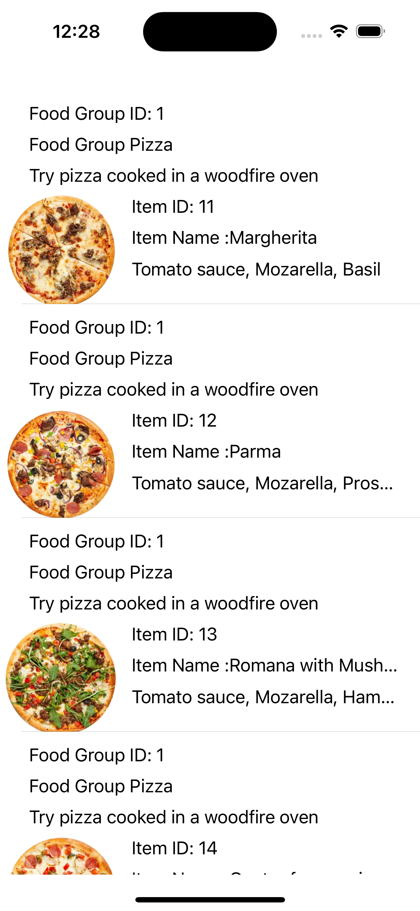

# 🍕 FoodItemsApp

**FoodItemsApp** is a Swift-based iOS application that showcases a list of food items and their details fetched from a REST API. The app displays both text details and images of food items in a dynamic table view. Designed using UIKit and Storyboard, this app demonstrates efficient API usage and table view customization.

---

## 📸 Screenshots

### Food List View
This view displays the food group details and their corresponding food items, including names, descriptions, and images.



---

## 🚀 Features

1. **Dynamic Food List:**
   - Displays food group details like ID, name, and description.
   - Shows a list of food items with their names, descriptions, prices, weights, and images.

2. **API Integration:**
   - Fetches food group and food item data from a REST API.
   - Implements `URLSession` for network requests.

3. **Image Loading:**
   - Dynamically fetches images for each food item using their `image_url`.
   - Uses asynchronous image loading with caching for better performance.

4. **Custom Table View Cells:**
   - Displays food item details in a visually appealing format with images and text.
   - Uses Auto Layout for responsive design.

---

## 📱 How to Use

1. Clone the repository:
   ```bash
   git clone https://github.com/YourGitHubUsername/FoodItemsApp.git
